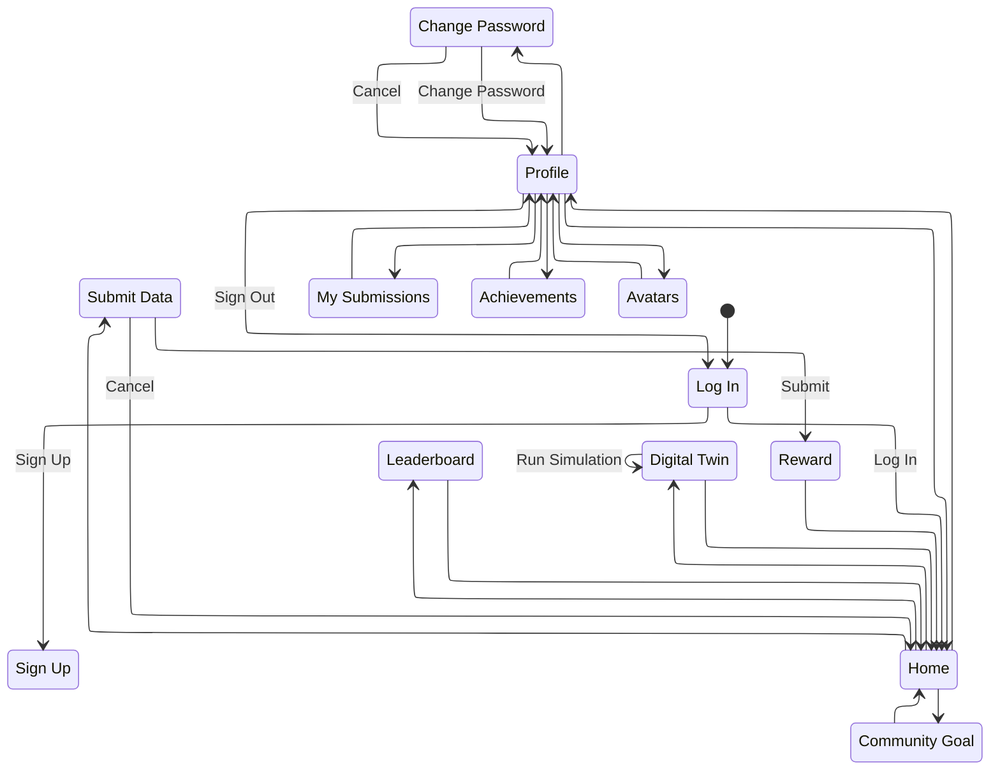

```mermaid
---
config:
    layout: elk
---
stateDiagram-v2
    signUp: Sign Up
    logIn : Log In
    home : Home
    leaderboard : Leaderboard
    communityGoal : Community Goal
    digitalTwin : Digital Twin
    submitData : Submit Data
    profile : Profile
    mySubmissions : My Submissions
    achievements : Achievements
    avatars : Avatars
    changePassword : Change Password
    reward: Reward


    [*] --> logIn
    logIn --> signUp : Sign Up
    logIn --> home : Log In
    home --> leaderboard
    home --> communityGoal
    home --> submitData
    home --> profile
    home --> digitalTwin
    leaderboard --> home
    communityGoal --> home
    submitData --> home : Cancel
    submitData --> reward : Submit
    reward --> home
    digitalTwin --> home
    digitalTwin --> digitalTwin : Run Simulation
    profile --> home
    profile --> mySubmissions
    profile --> achievements
    profile --> avatars
    profile --> changePassword
    profile --> logIn : Sign Out
    mySubmissions --> profile
    achievements --> profile
    avatars --> profile
    changePassword --> profile : Change Password
    changePassword --> profile : Cancel


```