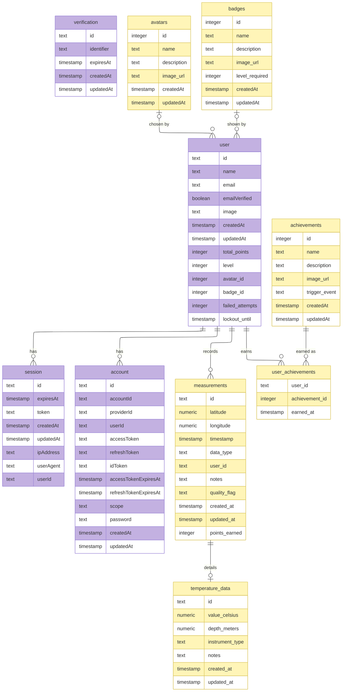

```mermaid
---
config:
    layout: elk
---

erDiagram
    user:::auth {
        text id
        text name
        text email
        boolean emailVerified
        text image
        timestamp createdAt
        timestamp updatedAt
        integer total_points
        integer level
        integer avatar_id
        integer badge_id
        integer failed_attempts
        timestamp lockout_until
    }

    session:::auth {
        text id
        timestamp expiresAt
        text token
        timestamp createdAt
        timestamp updatedAt
        text ipAddress
        text userAgent
        text userId
    }

    account:::auth {
        text id
        text accountId
        text providerId
        text userId
        text accessToken
        text refreshToken
        text idToken
        timestamp accessTokenExpiresAt
        timestamp refreshTokenExpiresAt
        text scope
        text password
        timestamp createdAt
        timestamp updatedAt
    }

    verification:::auth {
        text id
        text identifier
        timestamp expiresAt
        timestamp createdAt
        timestamp updatedAt
    }

    achievements:::cs {
        integer id
        text name
        text description
        text image_url
        text trigger_event
        timestamp createdAt
        timestamp updatedAt
    }

    avatars:::cs {
        integer id
        text name
        text description
        text image_url
        timestamp createdAt
        timestamp updatedAt
    }

    badges:::cs {
        integer id
        text name
        text description
        text image_url
        integer level_required
        timestamp createdAt
        timestamp updatedAt
    }
    
    measurements:::cs {
        text id
        numeric latitude
        numeric longitude
        timestamp timestamp
        text data_type
        text user_id
        text notes
        text quality_flag
        timestamp created_at
        timestamp updated_at
        integer points_earned
    }

    temperature_data:::cs {
        text id
        numeric value_celsius
        numeric depth_meters
        text instrument_type
        text notes
        timestamp created_at
        timestamp updated_at
    }

    user_achievements:::cs {
        text user_id
        integer achievement_id
        timestamp earned_at
    }

    classDef auth fill:#C3B1E1,stroke:#9B85D6,color#000
    classDef cs fill:#FFF5B8,stroke:#D9C45A,color#000

    user ||--o{ session : has
    user ||--o{ account : has
    user ||--o{ measurements : records
    user ||--o{ user_achievements : earns
    achievements ||--o{ user_achievements : "earned as"
    avatars |o--o{ user : "chosen by"
    badges |o--o{ user : "shown by"
    measurements ||--o| temperature_data : details
```